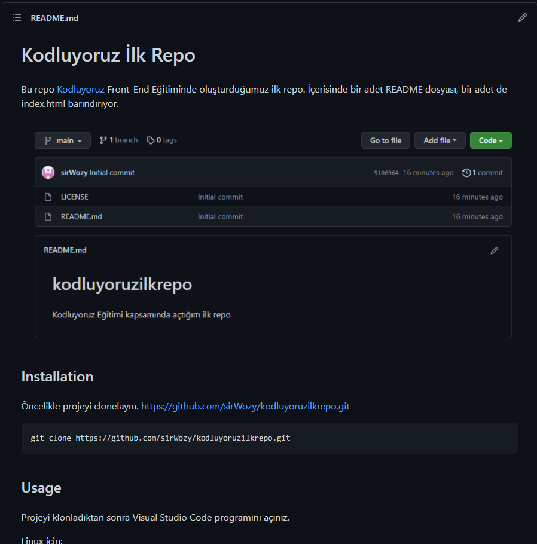

# Kodluyoruz İlk Repo

Bu repo [Kodluyoruz](https://www.kodluyoruz.org/) Front-End Eğitiminde oluşturduğumuz ilk repo. İçerisinde bir adet README dosyası, bir adet de index.html barındırıyor.



## Installation

Öncelikle projeyi clonelayın. https://github.com/sirWozy/kodluyoruzilkrepo.git

```
git clone https://github.com/sirWozy/kodluyoruzilkrepo.git
```

## Usage

Projeyi klonladıktan sonra Visual Studio Code programını açınız.

Linux için:

```
cd kodluyoruzilkrepo
code . 
```

## Contributing

Pull request kabul edilir. Büyük değişiklikler için lütfen önce neyi değiştirmek istediğinizi tartışmak için bir konu açınız.

## License 

[MIT](https://choosealicense.com/licenses/mit/)
